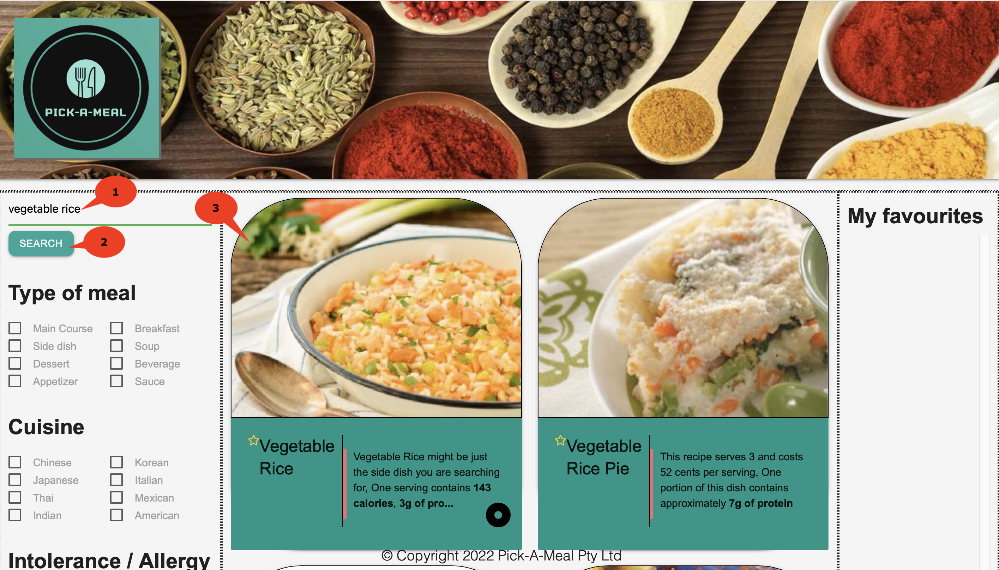
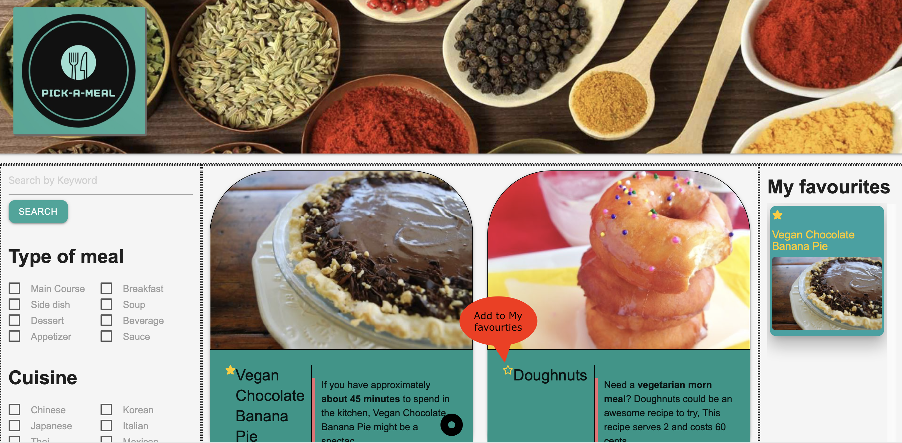
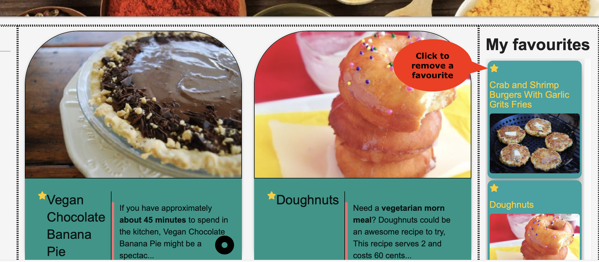
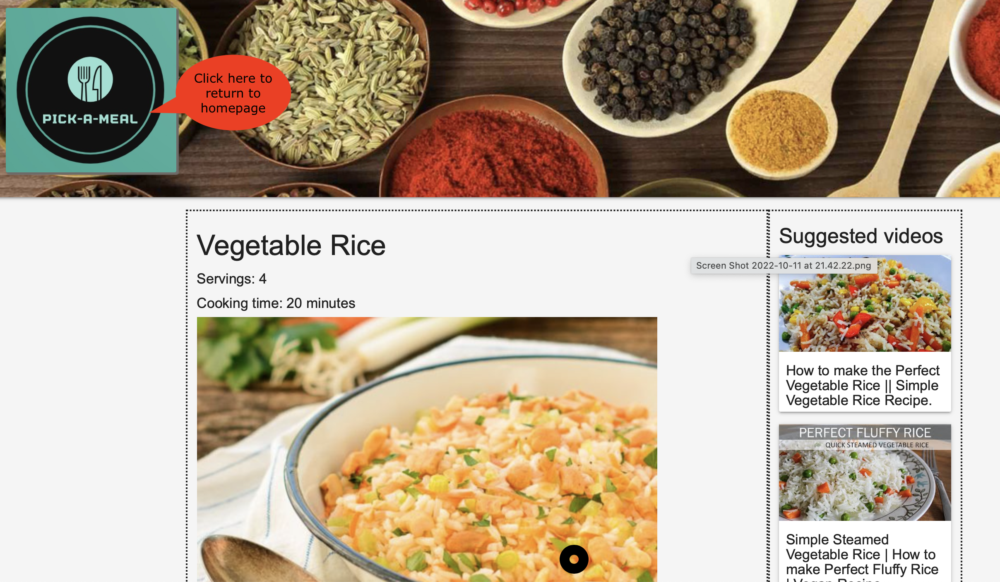

# Pick-A-Meal

The one-stop webpage for finding all of your favourite recipes.

Pick-A-Meal is a semantic search database that allows users to search and retrieve recipe suggestions. Users will then be able to save those recipes in a 'favourites' list which saves to their local machine. Once the user clicked through to their desired search result, suggested YouTube recipe videos also appear, alongside the chosen recipe.

Deployed URL of the application: https://jeco1988.github.io/Pick-A-Meal/

## Table of Contents

- [Credits](#credits)
- [License](#license)
- [Installation](#installation)
- [Technologies used](#technologies-used)
- [Feratures usage and instructions](#features-usage-and-instructions)
- [Further work and improvements](#further-work-and-improvements)

## Credits

- Header Image: https://www.freewebheaders.com/food-beverage/food-headers/
- Spoonancular API: https://spoonacular.com/food-api
- You Tube API: https://developers.google.com/youtube/v3/guides/implementation/search

## License

Please refer to the repo.

## Installation

Not applicable

## Technologies used

- HTML 5
- JavaScript DOM
- jQuery
- Spoonacular API, for semantic search
- You Tube API, for displaying recipe suggestions for the selected recipe
- Materialize CSS
- Font Awsome

## Features, usage and instructions

### Application website

- Go to https://jeco1988.github.io/Pick-A-Meal/

### Random recipies

1. On loading the main page, you will be presented with four random recipies
2. Click on the image, to view the recipe in detail.
   

### Search for a recipe

1. Enter your search term in the textbox. Note: You can enter one or several words to get a better search result
2. Click on the Search button. The top four search results are displayed
3. Click on the image of the search result, to view the recipe detail.
   

### Add favourites

1. Select the start icon against a recipe, in the search results (see image III).
2. The selected recipe is added to the list
3. Your favourites appear on the "My Favourites" list. Note: The favourite list is reloaded with anything saved when you open the browser window.
   

### Remove favourites

1. Select the start icon against a recipe, from the "My Favourites" list (see image IV).
2. The item is removed the "My Favourites" list. Note: The recipe removed will no longer appear when reloading your browser.
   

### Return to main page

When you are on the recipe detail page, you can:

- Select the back button from the browser, and return to the main page
- Alternatively, select the Pick-A-Meal logo from the header, and return to the main page (see image V).
  

## Further work and improvements

- Filter / search by 'type of meal', 'cusine' and 'intolerance/allergy' not implemented due to time constraints
- Display multiple search results and pagination (currently, the search results are limited to the 'top four' results)
- Create a 'github secret' for the spoonify API key (as this is a paid service)
